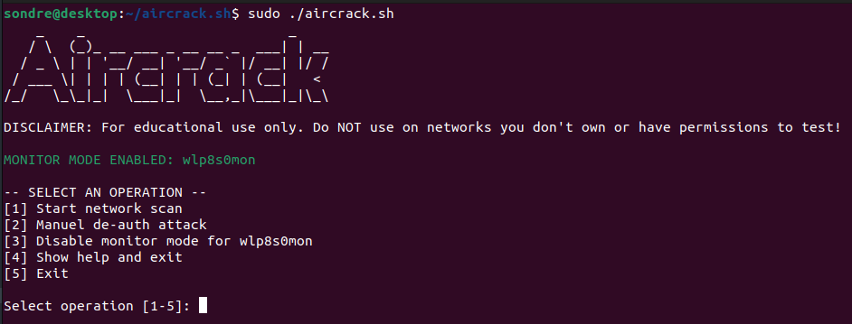

# aircrack.sh
A script based on the aircrack-ng package. Used to simplify network penetration testing.

## Disclaimer
#### For educational use only. Do NOT use on networks you don't own or have permissions to test!

## Features
 - Scan all nearby networks.
 - See connected clients to a particular network.
 - De-auth attacks and key cracking.
 - Save targets for later use.

## Required packages
Run the following commands in a Linux terminal to install packages (Ubuntu):
```console
sudo apt update
 ```
```console
sudo apt install aircrack-ng figlet -y
 ```
 
## Usage
NB: You need root privileges to run the script!
```console
Usage: ./aircrack.sh <options>

NB: Script requires root privileges!

Options:
 -i <interface>: Wireless network interface to use. Default is wlp8s0.
 -f <password file>: Path to password file for cracking network key.
 -v: Verbose mode. Print out debug information, must be the last flag.
 -h: show help
 ```
 
 ## Screenshot

